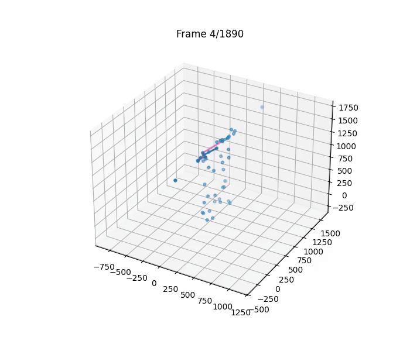

# Lifestep-Internship

## Overview 

This repository presents human motion analysis projects,
ranging from **3D biomechanical visualization** and **EMG signal processing**
to deep learning- and machine-learning–based **basketball shooting form classification** and **AI basketball coach systems.**

1️⃣ 3D Motion Visualization & Skeleton Reconstruction  
2️⃣ Joint-angle extraction (including other biomechanical variables)  
3️⃣ EMG preprocessing & Motion Synchronization  
4️⃣ Real-Time EMG-Based Prosthetic Hand Control  
5️⃣ Basketball Shooting Form Classification (GOOD / BAD)    
6️⃣ AI Basketball Shooting Coach

---
## Image & GIF

### 1.3D visualization 

## 3D Cutting Motion Visualization

## 3D Squat Motion Visualization

### 2. joint-angle extraction (including other biomechanical variables)

### 3.EMG preprocessing

## 4. Real-Time EMG-Based Prosthetic Hand Control (TD + CNN + TCN)

## 5,6. Basketball Shooting Form Classification (GOOD / BAD) & AI Basketball Shooting Coach
**Data sourced from the LJM Basketball Academy (founded and operated by the author)**

### YOLOv8 Pose Estimation

  
  
  

## Basketball Shooting Form Classification (GOOD / BAD) User Interface

## AI Basketball Shooting Coach Program User Interface

---

## Description

## 1. 3D Motion Visualization & Skeleton Reconstruction
This module focuses on 3D marker-based motion-capture visualization using Qualisys-style .mat datasets (e.g., squat.mat, cutting.mat).
The goal is to transform raw marker trajectories into interpretable **3D skeletal representations**, 
enabling visual inspection of human movement patterns before downstream biomechanical or machine-learning analysis.

---

## 2. Joint-angle extraction (including other biomechanical variables) 

Using datasets such as **squat.mat** and **cutting.mat**, I implemented scripts to:

- Load and parse motion-capture data  
- Extract joint variables including:  
  - **Knee, hip, and ankle angles  **
  - Pelvis kinematics  
  - Additional biomechanical variables available in the .mat datasets **(e.g., GRF(Ground Reaction Force), marker trajectories, etc.)** 
- Identify key movement phases (squat cycles, cutting phases)

---

## 3. EMG Signal Pre-processing & Motion Synchronization

This module performs full EMG preprocessing and synchronizes the processed signals with 3D marker-based motion data collected during squat and cutting tasks.

**Pre-processing Pipeline**

Five raw EMG channels are processed using:

-DC offset removal

-60 Hz notch filtering

-Band-pass filtering (physiological EMG range)

-Full-wave rectification

-RMS + envelope extraction

-These steps produce clean, analysis-ready activation signals.

### EMG–Motion Synchronization

Processed EMG envelopes are time-aligned with 3D marker trajectories (barbell markers + lower-body markers).

This makes it possible to compare muscle activation with movement phases.

Example observations:
Quadriceps activation peaks consistently at the bottom of each squat cycle.

From this synchronized analysis, users can examine:
-Muscle activation timing
-Left–right asymmetry or compensation patterns
-Movement efficiency

### Cutting Movement Analysis

Although the repository currently shows squat examples,
the same EMG–motion synchronization workflow was applied to cutting tasks to analyze activation strategies in more dynamic movements.

---

## 4. Real-Time EMG-Based Prosthetic Hand Control (TD + CNN + TCN)

I developed a lightweight real-time regression model using:

- Time-Domain (TD) features (MAV, WL, ZC, SSC, RMS)
- 1D CNN layers for spatial pattern extraction
- TCN layers with dilation for temporal modeling  

The model processes **EMG signals as input** and performs inference every **0.01 seconds (100 Hz)**, enabling real-time operation.  
The final output consists of **17 joint angles**, representing multi-DOF finger and wrist movements.

This repository includes the full model architecture and training code used to build the **prosthetic control system**.

---

## 5. Basketball Shooting Form Classification (GOOD / BAD) (CNN + LSTM vs XGBoost)

I independently built **a basketball shooting-form classification** pipeline using **YOLOv8-Pose** during my internship at LifeStep.
From each shooting video, I extracted 2D keypoints and derived interpretable time-series features
(e.g., elbow angle trajectory and normalized wrist height). Each sequence was resampled to a fixed
length and normalized.

To evaluate modeling choices under a small annotated dataset setting **(N = 107)**,
I compared two approaches:

- **CNN + LSTM**: temporal deep model to learn motion dynamics directly from the resampled sequences  
- **XGBoost**: tree-based classifier trained on flattened pose-derived feature vectors  

### Results (Stratified 5-Fold Cross-Validation, N = 107)

| Model      | Accuracy (mean ± std) | F1-score (mean ± std) |
|------------|------------------------|------------------------|
| CNN + LSTM | 0.66 ± 0.07             | 0.64 ± 0.08            |
| XGBoost    | **0.74 ± 0.04**         | **0.73 ± 0.05**        |​

In this limited-data regime, **XGBoost showed more stable generalization across folds**,
while the CNN+LSTM model exhibited higher variance, suggesting sensitivity to overfitting
when training temporal deep models with **small labeled datasets**.

---

## 6. AI Basketball Shooting Coach (XGBoost Regression + SHAP)

Building upon the pose-based shooting analysis developed in Project 5,
I implemented an end-to-end **AI basketball shooting coach** that predicts
a continuous shooting-form score and provides **explainable, body-part-level feedback**.

From each shooting video, pose-based features were extracted using **YOLOv8-Pose**
and used to train an **XGBoost regression model** that predicts a numeric
shooting-form score on a 0–100 scale.
To improve interpretability, **SHAP** was applied to estimate the relative
importance of different body components (elbow, wrist, lower body) for each prediction.

A lightweight **Streamlit-based web interface** was implemented to allow users
to upload a shooting video and receive a score along with interpretable,
coach-style feedback.

### Results (5-Fold Cross-Validation, N = 107)

| Metric | Value (mean ± std) |
|------|---------------------|
| MAE  | 7.2 ± 0.4 points    |
| R²   | 0.59 ± 0.04         |

On average, the model predicts shooting-form scores within approximately
±7 points of the ground-truth labels and explains around 60% of the variance
in shooting-form quality, demonstrating the feasibility of pose-based,
explainable scoring under a small-data setting.

